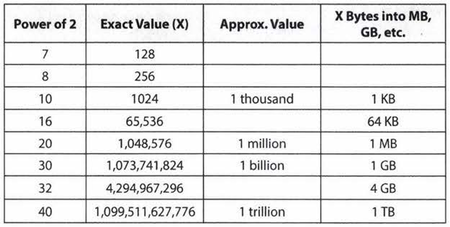

# CrackingTheCodingInterview
Chapter by chapter completing exercises.

"Why do you want to work for Microsoft?"
In this question, Microsoft wants to see that you're `passionate about technology`. A great answer might be, "I've been using Microsoft software as long as I can remember, and I'm really impressed at how Microsoft manages to create a product that is universally excellent. For example, I've been using Visual Studio recently to learn game programming, and its APls are excellent:' Note how this shows a passion for technology!

Amazon cares a lot about scale. Make sure you prepare for `scalability` questions.
See our recommendations in the `System Design and Scalability chapter`.

***

// TODO: Make sure my current resume meets these standards:
__Take the Big Project Classes:__ Seek out the classes with `big coding projects`.This is a great way to get some- what practical experience before you have any formal work experience. The more relevant the project is to the real world, the better.
__Get an Internship:__ Do everything you can to land an internship early in school. It will pave the way for even better internships before you graduate. Many of the top tech companies have internship programs designed especially for freshman and sophomores. You can also look at startups, which might be more flexible.
__Start Something:__ Build a project on your own time, participate in hackathons, or contribute to an `open source project`. It doesn't matter too much what it is.The important thing is that you're coding. Not only will this develop your technical skills and practical experience, your initiative will impress companies.

***

| Common Questions          | Example                                                       |
| ------------------------- |:-------------------------------------------------------------:|
| Challenges                | TrailHub, needed mentorship (Doug)                            |
| Mistakes & Failures       | Stubborness                                                   |
| Enjoyed                   | Teamwork, fresh perspectives                                  |
| Leadership                | EDUCodes, leadership is about bringing out the best in others |
| Conflicts                 | Personality differences, incentives                           |   
| What you'd do differently | Could have started without guidance, imposter syndrome        |

***

Questions to ask interviewers:
1. Genuine
"What brought you to this company? What has been most challenging for you?"
2. Insightful
"I noticed that you use technology X. How do you handle problem Y?"
3. Passion
"I'm not familiar with technology X, but it sounds like a very interesting solution. Could you tell me a bit more about how it works?"

***

Whenever telling a story, follow these steps:
1. Nugget/The problem
2. Situation
3. Action
4. Result
5. Meaning

***

__Next Up!! Big O__
Best, worst, and expected cases describe the big a(or big theta) time for particular inputs or scenarios.

Big 0, big omega, and big theta describe the upper, lower, and tight bounds for the runtime.

Space vs Time Complexity

Straight recursion = O(n)

Additional Problems:
VI.1  O(b) ✅
VI.2  O(b) ✅
VI.3  O(1) ✅
VI.4  O(b/a), oof almost O(a/b)
VI.5  O(log n) ✅
VI.6  O(n), no (guess*guess > n ) == (guess > sqrt(n))
VI.7  O(n) ✅
VI.8  O(n) ✅
VI.9  O(n^2) ✅
VI.10 O(# of digits) almost!!! # of digits = 10^d (d = log n), so O(log n)

***

Technical Questions

How to practice for them:
1. Solve problem on my own
2. Write code on paper
3. Test on paper: general, base, edge cases
4. Type code in as-is, write down errors and keep track

__What you need to know__

| Data Structures        | Algorithms            | Concepts                  |
| ---------------------- |:--------------------- |:-------------------------:|
| Linked Lists   ✅        | Breadth-First Search  | Bit Manipulation          |
| Trees, Tries, & Graphs | Depth-First Search    | Memory (Stack vs. Heap)   |
| Stacks & Queues ✅       | Merge Sort            | Recursion                 |
| Heaps                  | QuickSort             | Dynamic Programming       |
| Vectors/ArrayLists     | Binary Search         | Big 0 Time & Space        |
| Hash Tables ✅           |                       |                           |

Implement each from scratch!

***

__Powers of Twos__

__Problem Solving Method__
See CrackingTheCodingInterview.com

__Beautiful Code Means:__
1. Modular, have a function initialize the dataset
2. Error Checks, add a //todo
3. Use classes where appropriate
4. Good variable names

BUD
Bottle Neck
Unnecessary Code
Duplicate Code

Best Conceivable Runtime

End of Introduction, ready to dive into exercises!!!
***
